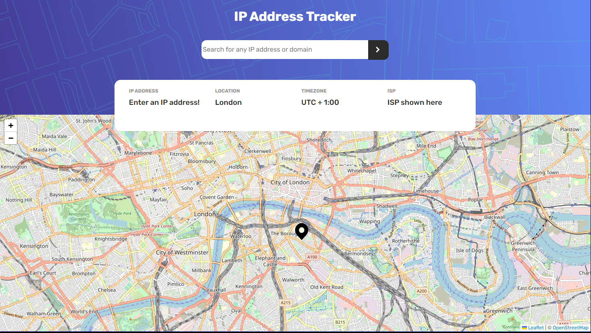
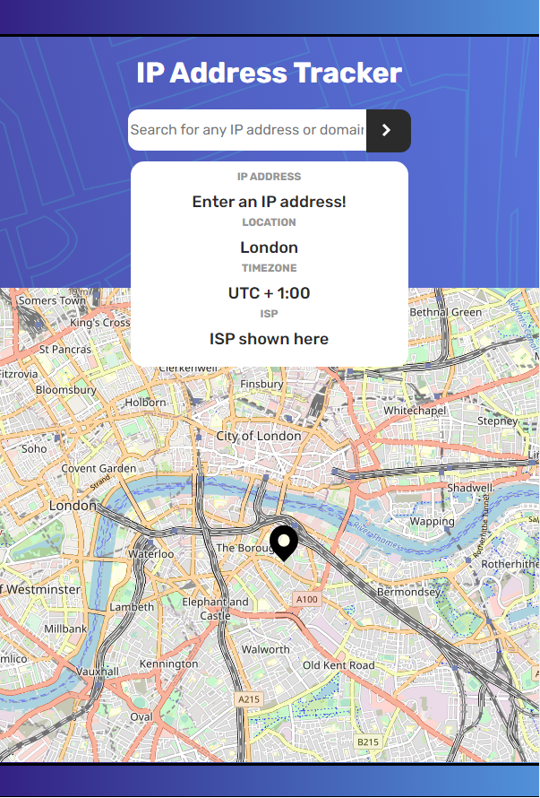

# Frontend Mentor - IP address tracker solution

This is a solution to the [IP address tracker challenge on Frontend Mentor](https://www.frontendmentor.io/challenges/ip-address-tracker-I8-0yYAH0).

## Table of contents

- [Overview](#overview)
  - [The challenge](#the-challenge)
  - [Screenshot](#screenshot)
  - [Links](#links)
- [My process](#my-process)
  - [Built with](#built-with)
  - [What I learned](#what-i-learned)
  - [Continued development](#continued-development)
- [Author](#author)

**Note: Delete this note and update the table of contents based on what sections you keep.**

## Overview

### The challenge

Users should be able to:

- View the optimal layout for each page depending on their device's screen size
- See hover states for all interactive elements on the page
- See their own IP address on the map on the initial page load
- Search for any IP addresses or domains and see the key information and location

### Screenshot





### Links

- Live Site URL: [Github Page](https://your-live-site-url.com)

## My process

### Built with

- Semantic HTML5 markup
- CSS custom properties
- Responsive CSS design (media queries)
- Flexbox
- JQuery
- Fetch API
- Leaflet & Geoifipy API

### What I learned

In general I learned most of the syntax with JQuery and how to add it to my Javascript code.

A concrete example of an obstacle I faced for this project is figuring out how to change the text of the four information boxes shown when you search for an IP address which I figured out that I could simply do with .text

The other thing that I had to figure out which was essential is placing the input of the textbox to be a variable for my button click function - I used .val() to get the ip address as a variable.

```js
let address = $('#input-text').val();
```
Now the next problem is how should I even create a function when the submit button gets clicked. I was thinking of using addEventListeners however in JQuery I can use something called a keypress.

```js
$('#input-text').keypress((event) =>{
    if(event.keyCode === 13){
        $('#submit').click();
    }
});
```

### Continued development

I did not find a use for the mobile background pattern for this project. However, as I mentioned in my last README I wanted to get better at making my website as reponsive as it could be. I learned more about CSS media queries and designed how the website would look like when the width gets less than 800 pixels.

All these projects are a learning stage for me and for my future projects I will incorporate more responsiveness. I'm aware that maybe I can't find a use for the mobile image because I stil lack knowledge.


## Author

- Website - [John Leomarc Alonzo](https://acelmor.com)
- Frontend Mentor - [@alonzo0812](https://www.frontendmentor.io/profile/alonzo0812)

**Note: Delete this note and add/remove/edit lines above based on what links you'd like to share.**
